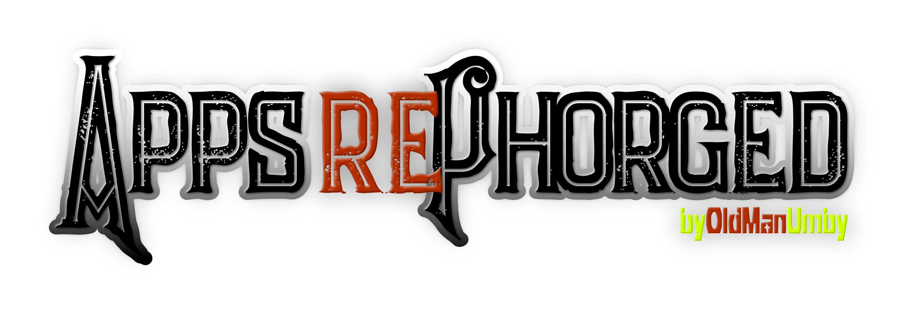
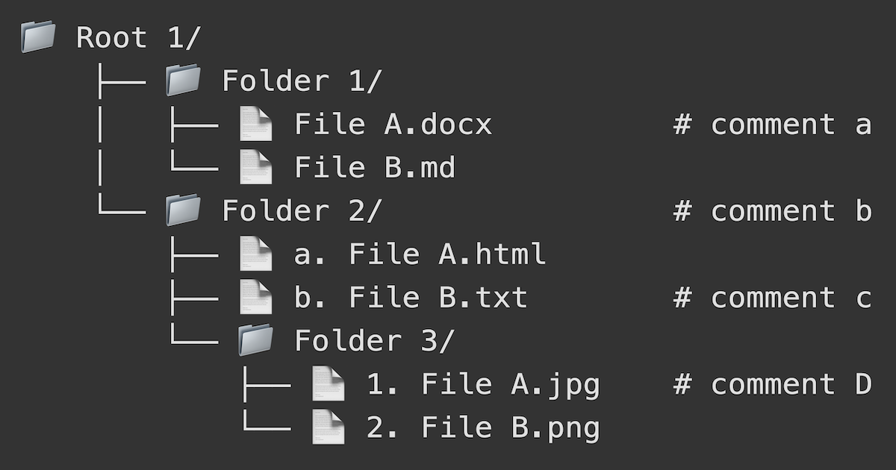

# treePhorge

A Markdown/ASCII tree diagram and structure generator. Designed and tested for AI readability. All contained in a simple HTML file for easy local runs.

## Overview

treePhorge is a versatile, browser-based tool that instantly converts your plain text or Markdown outlines into clean, well-structured ASCII tree diagrams. Whether you're planning a new software project, documenting an existing codebase for AI readability, or just organizing your thoughts, treePhorge handles the formatting automatically. It runs entirely in your browser with no installation required, ensuring your project structures stay private and secure.

## Features

- **Multiple Input Methods**: Create directory trees using regular indented text (two spaces per pathway) or standard Markdown headers and lists.
- **Smart Metadata & Comments**: Add `#` comments that auto-align in the visual diagram and export as dedicated comment files.
- **Find & Replace System**: Transform file and folder names on the fly with custom rules and quick-access presets (e.g., swapping spaces for underscores).
- **Robust Exporting**: Download your complete generated structure as a `.zip` archive containing your actual folders and files in formats like `.txt`, `.html`, or `.md`.
- **Customizable UI & Output**: Toggle dark mode, file/folder icons, trailing slashes, root connections, and capitalization to suit your visual preferences.

## Requirements

- A modern web browser (Chrome, Firefox, Safari, Edge, etc.)
- JSZip : Required for exporting `.zip` archives (loaded via CDN automatically).

## Installation

1. Download the scripts (`index.html`, `script.js`, `style.css`) to your local machine. You can clone the repository or download the latest release.
2. Ensure they are all placed within the same directory.
3. [Optional] If you intend to use the export features completely offline, download the `JSZip` library locally and update the `<script>` source link in `index.html`.

## Configuration

When you first run treePhorge, you can configure the following settings directly in the interface. All settings are saved to your browser's Local Storage for future use:

1. **Theme Settings**: Toggle Dark Mode, preserve ordering, show trailing folder slashes, and connect roots.
2. **Display Settings**: Toggle folder icons, file icons, and force all-caps text output.
3. **Format Settings**: Configure Find & Replace rules, select your preferred export file format (Text, HTML, Markdown, or Keep Original).
   - Sub-setting consideration: You can also toggle whether original inputs, converted outputs, and comments are included in your `.zip` export.

## Usage

To get started, simply type or paste your folder structure into the input area. The app updates the visual tree diagram in real time. Markdown is parsed automatically when typed or pasted.

### Running the Script

You can execute the app simply by opening the HTML file in your web browser. No local server or terminal commands are required. MacOS / Linux / Windows: Double-click `index.html`.

### Example Workflow

1. Plan your project in the input area using a Markdown format with structured headers (e.g., `# Root`, `## Folder`) and lists (`- File.txt`).
2. Adjust your display settings (like toggling Dark Mode or enabling Folder Icons) to visualize the structure clearly.
3. Apply any desired Find & Replace rules to quickly format file/folder names (e.g., converting all spaces to dashes).
4. Click "Export Files" to download a complete `.zip` archive of your generated structure to your local machine.

### Advanced Features

- **Comment Preservation**: Include comments by appending `# your comment` to any line. During export, toggle the setting to include comments, and they will be saved as separate `_comments.txt` files inside their respective folders.
- **Advanced Find & Replace**: Use the preset buttons for common transformations (like swapping underscores and dashes), or create unlimited custom rules that apply to all files and folders during export.

## Troubleshooting

- **Export button does nothing**: Verify your internet connection to ensure the `JSZip` library has loaded correctly from the CDN.
- **Markdown not parsing correctly**: Ensure your Markdown file contains headers at the selected level with a proper space after the hash (e.g., `# Folder` instead of `#Folder`).

## License

This project is licensed under the GNU General Public License v3.0 (GPL-3.0) . You are free to use, modify, and distribute this software, provided that you:

- Disclose the source code of any modifications you make.
- License your modified versions under the same GPL-3.0 license.
- Preserve the original copyright notices and disclaimers.

See the LICENSE file for the complete text of the GPL-3.0 license.